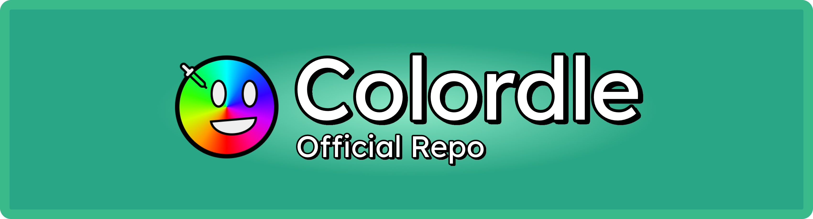

# Colordle

Welcome to the official repository for Colordle, a color-guessing game inspired by Wordle. This project is developed using the Godot Engine (version 4.5) and is open-source.

> [!WARNING]
> This project is currently in active development. Features may change, and bugs are expected. Please report any issues you encounter on the GitHub repository.
